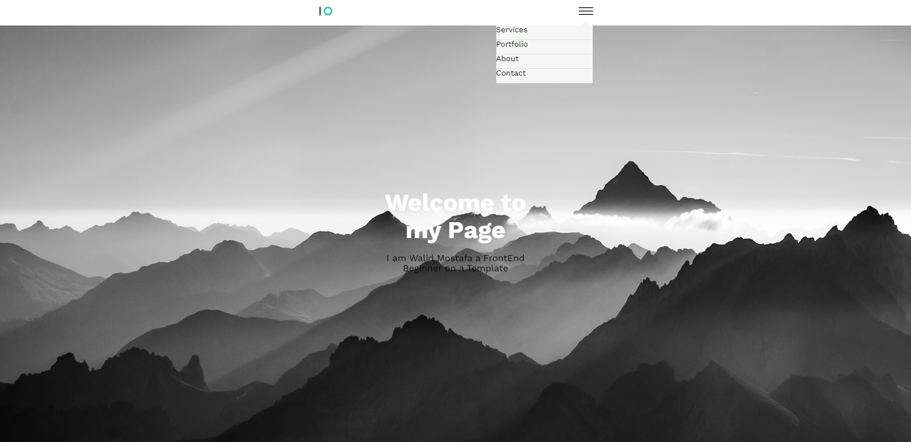
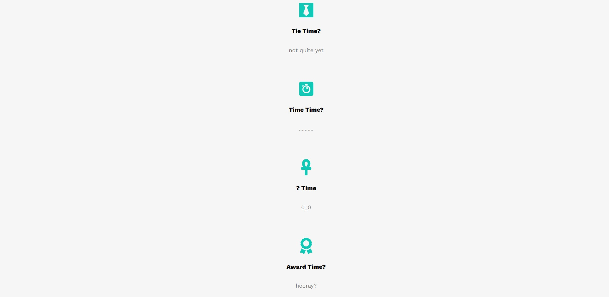
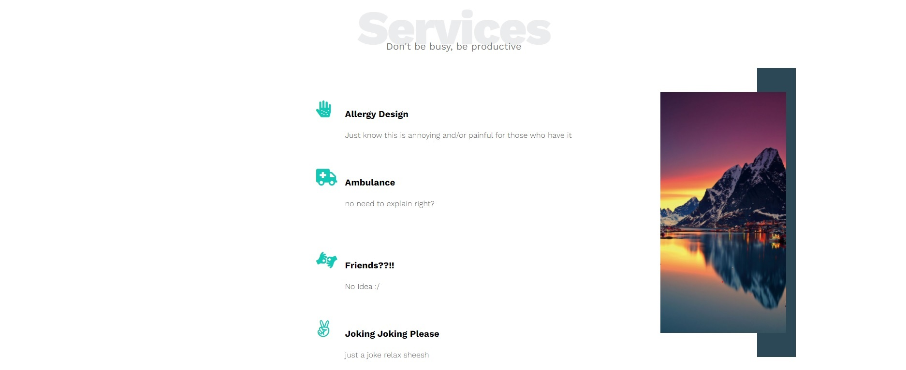
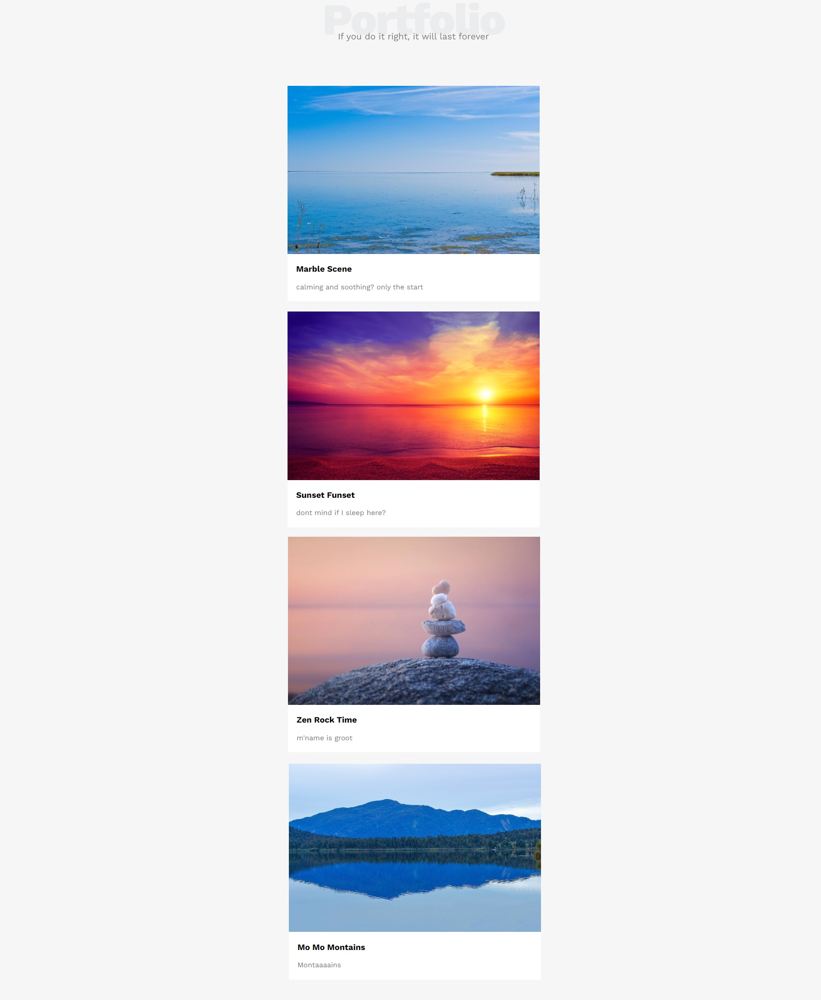

- Overview:
  - [My First Template Look-Alike](#the-challenge)
  - [https://wella4life.github.io/Template_1/](#links)
  - 
  - 
  - 
  - 
  - 
  - 

 - Users should be able to:
   - View the optimal layout for the site depending on their device's screen size
   - Hover Stats and Animation on everything

 - What I Learned:
   - This is my first ever project so I literally learned everything
 
 - What I Couldn't Do:
   - Fix Mobile Version to be exact
   - Take care of margins and paddings properly
   - Apply Perfect width and height to the content
